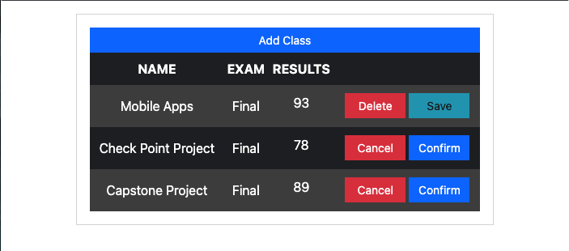
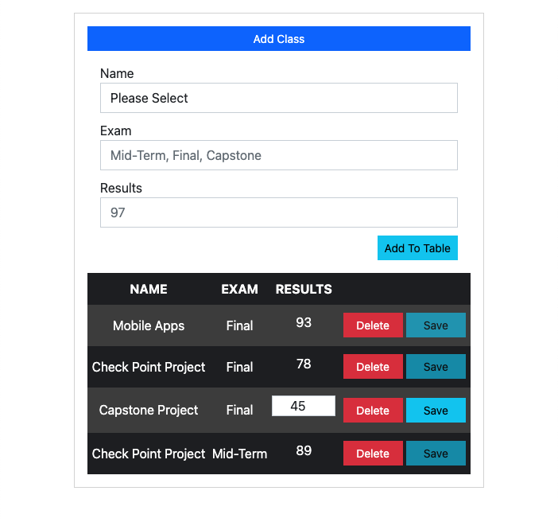
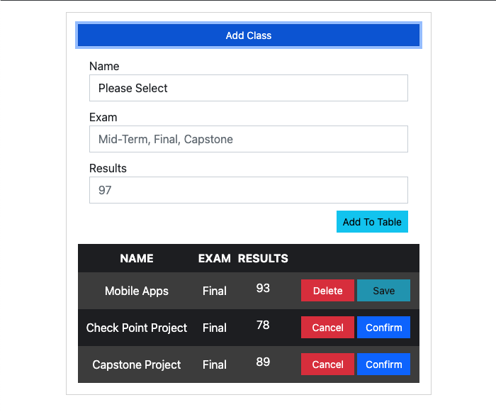

# Week 10 - SODA DINER CHECK POINT #

<div style="position: relative; top: 0em; text-align: center;">

</div>

Week 10 - BASIC CRUD FUNCTIONALITY

- [Reminder](#reminder)
- [Instructor's Note](#instructors-note)
- [Background](#background)
- [Learning Objectives](#learning-objectives)
- [Glossary](#glossary)
- [Starting Point](#starting-point)
- [First Steps](#first-steps)
- [Second Step](#second-step)
- [Third Step](#third-step)
- [Fourth Step](#fourth-step)
- [Fifth Step](#fifth-step)
- [Sixth Step](#sixth-step)
- [Seventh Step](#seventh-step)
- [Eighth Step](#eighth-step)
- [Final Thoughts](#final-thoughts)
- [Review Questions](#review-questions)

---

## Reminder ##

Please remember to start recording the RI session <span style="color: red;">BEFORE</span> the session begins. The check-in question should be present in the recording. Remind students that they are being recorded.

---

## Instructor's Note ##

This is a not a lengthy lesson plan. However, it may still be necessary for you to limit side discussions as much as possible in order to set a good pace. That being said, make sure to answer any questions throroughly and completely while moving through the material.

---

## Background ##

The students should have a working full-stack app that utilizes API calls and serves out templated HTML with EJS and Express. They should also have a database built on their local environment using MongoDB, and their app should be able to read and create documents with that database. For that reason, here, we are going to focus on the CRUD functionality to give students a more clear and concise way to implement CRUD operations.

---

## Learning Objectives ##

By the end of this session, learners will be able to:

- Perform the CREATE method by creating data from a form
- Perform the READ method by reading data from a form
- Perform the UPDATE method by updating data from a form
- Perform the DELETE method by deleting data from a form
- Creating front-end elements to handle the CRUD operations using `jQuery`

---

## Glossary ##

- `jQuery`:  jQuery is a concise and fast JavaScript library that can be used to simplify event handling, HTML document traversing, Ajax interactions and animation for speedy website development. jQuery simplifies the HTML's client-side scripting, thus simplifying Web 2.0 applications development.

- `CRUD`: CRUD is an acronym that comes from the world of computer programming and refers to the four functions that are considered necessary to implement a persistent storage application: create, read, update and delete.

---

## Starting Point ##

Before we begin this lesson, let's grab our `/grades-crud-app` directory. Move it to your `Documents` directory and initialize it as a git repository.

```bash
  > git clone </"ADD YOUR COPY OF THE REPO HERE">       
  ## CLONES YOUR PROJECT 

  > cd </"INTO THE FILE YOU JUST CLONED">      
  ## CHANGES DIRECTORY

  > git init       
  ## INITIALIZE YOUR PROJECT

  > git add .      
  ## ADD ALL FILES TO YOUR COMMIT

  > git commit -m "First commit"      
  ## COMMITS YOUR PROJECT

  > git push      
  ## PUSHES YOUR PROJECT TO YOUR GET REPOSITORY
```

---

## First Steps ##

<details open>
<summary>Adding HTML</summary>
<br>

Before we can actually perform any CRUD action, we must first provide the user with a way to perform these operations. Let's start by adding a couple of buttons to the form that get rendered to the home page. Open up th `index.html` file in your editor and add the following:

Now we are going to add the `<html></html>` content to make sure that our code is and can be connect to our page

```html
  <head>
    <meta charset="UTF-8">
    <meta http-equiv="X-UA-Compatible" content="IE=edge">
    <meta name="viewport" content="width=device-width, initial-scale=1.0">

    <title>Grade CRUD App</title>

    <!-- BOOTSTRAP -->
    <link rel="stylesheet"
          href="https://cdn.jsdelivr.net/npm/bootstrap@5.2.0/dist/css/bootstrap.min.css"
          integrity="sha384-gH2yIJqKdNHPEq0n4Mqa/HGKIhSkIHeL5AyhkYV8i59U5AR6csBvApHHNl/vI1Bx" 
          crossorigin="anonymous">

    <!-- jQUERY -->
    <script src="https://code.jquery.com/jquery-3.4.1.js"></script>

    <!-- CUSTOM STYLES -->
    <link rel="stylesheet" href="css/main.css">

  </head>
```

Now we are going to add the `<form></form>` in our `<body></body>` content to make sure that our code is and can be connect to our page

```html
<body>
    <div>

      <!-- BOOTSTRAP CONTAINER -->
      <div class="container">

        <!-- BOOTSTRAP 12 COLUMN, MEDIUM -->
        <div class="col-md-12">

          <!-- GIVES A NICE BORDER AROUND APPLICATION -->
          <div class="card card-body">

            <!-- FORM WRAPPER & BUTTON -->
            <button class="btn btn-sm btn-primary" id="add-class"> Add Class </button>

            <!-- FORM THAT WILL BE HIDDEN UPON INITIAL DISPLAY -->
            <div class="form-wrapper hidden">
              
              <!-- SELECT OPTIONS INPUT -->
              <label for="">Name</label>
              <select id="class-name" class="form-control">
                <option value="">Please Select</option>
                <option value="Mobile Apps"> Mobile Apps </option>
                <option value="Check Point Project"> Check Point Project </option>
                <option value="Capstone Project"> Capstone Project </option>
              </select>

              <!-- EXAM INPUT -->
              <label for="">Exam</label>
              <input type="text" class="form-control" id="class-exam" placeholder="Mid-Term, Final, Capstone">
              
              <!-- RESULTS INPUT -->
              <label for="">Results</label>
              <input type="number" class="form-control" id="class-result" placeholder="97">
              
              <!-- BUTTON TO ADD ROW TO TABLE -->
              <div id="add-to-table">
                <button class="btn btn-sm btn-info" id="create-class"> Add To Table </button>
              </div>
              
            </div>

            <!-- TABLE DATA -->
            <table>
              <thead>
                <tr>
                  <!-- TABLE HEAD  -->
                  <th scope="col">NAME</th>
                  <th scope="col">EXAM</th>
                  <th scope="col">RESULTS</th>
                </tr>
              </thead>
              <tbody id="class-table">
                <!-- BODY OF TABLE IN JAVASCRIPT -->
              </tbody>
            </table>
          </div>
        </div>
      </div>
    </div>

    <!-- JAVASCRIPT -->
    <script type="text/javascript" src="js/main.js"></script>
  </body>
```

Pay particular attention to the difference between this `form` and the `movie-form.ejs` file from `Movie-Buzz` project. Discuss how the context works, starting with how it is sent from the form.

</details>

---

## Second Step ##

<details open>
<summary>Adding Functionality To Loop</summary>
<br>

Here, we are going to create a form that the populate the objects value by the objects key. This will allow us to loop through each row and populate the table with CREATED data.

```javascript
function addRow(obj) {
  let row = `<tr scope="row" class="class-row-${obj.id}">
              <td> ${obj.name} </td>
              <td> ${obj.exam} </td>
              <td class="flexCenter" id="result-${obj.id}" data-testid="${obj.id}"> ${obj.result} </td>
              <td>
                <button class="btn btn-sm btn-danger"
                  data-testid="${obj.id}"
                  id="delete-${obj.id}"> Delete
                </button>

                <button class="btn btn-sm btn-info" 
                  disabled
                  data-testid="${obj.id}" 
                  id="save-${obj.id}"> Save 
                </button>
                
                <button class="btn btn-sm btn-danger hidden" 
                  data-testid="${obj.id}" 
                  id="cancel-${obj.id}"> Cancel 
                </button>

                <button class="btn btn-sm btn-primary hidden" 
                  data-testid="${obj.id}" 
                  id="confirm-${obj.id}"> Confirm 
                </button>
                
              </td>
            </tr>`;

  // APPEND ROW TO TABLE
  $('#class-table').append(row)

  // CALLING THE EVENT HANDLERS
  $(`#delete-${obj.id}`).on('click', deleteTest)
  $(`#save-${obj.id}`).on('click', saveUpdate);
  $(`#confirm-${obj.id}`).on('click', confirmDeletion);
  $(`#cancel-${obj.id}`).on('click', cancelDeletion);
  $(`#result-${obj.id}`).on('click', editResult);

}
```

> `Consider This`  
> What do you think the significance of the `data-testid` attribute is?  
>> Expect: These are data tags that allow a developer to pull information out of the HTML element itself.

</details>

---

## Third Step ##

<details open>
<summary>Adding CSS</summary>
<br>

Now let's add a little styling to this page to make it look presentable. Open up `css/main.css` in your editor and append the following rules:

```css
html, body { height: 100%;  width: 100%; }

.container { padding-top: 1em; height: 100%; width: 100%; }

.card-body {
  border-radius: 0;
}

.form-wrapper {
  padding: 1em;
}

.hidden {
  display: none;
}

.btn, .form-control {
  border-radius: 0;
}

.form-control {
  margin-bottom: 10px;
}

table {
  width: 100%;
  background-color: rgb(32, 33, 36);
  color: white;
}

th, td {
  text-align: center;
}

th {
  background-color: rgb(32, 33, 36);
  padding: 0.5em 0;
}

tr:nth-child(odd) {
  background-color: rgb(69, 69, 69);
}

td {
  padding: 10px 0 11px;
}

td.flexCenter {
  display: flex;
  justify-content: center;
}

.result {
  max-width: 80px;
  text-align: center;
  padding: 0;
  width: 80px;
}

#add-to-table {
  display: flex;
  justify-content: flex-end;
}

td > button.btn {
  width: 75px;
}

```

</details>

---

## Fourth Step ##

<details open>
<summary> Adding Edit Functionality </summary>
<br>

### Setting Up the Edit Functionality ###

```js
function editResult() {
  // USING DATA WITH OBJECT ID
  const testid = $(this).data('testid');

  // UPDATE VALUE OF INPUT
  const value = $(`#result-${testid}`).val();

  // UNBIND BAD BEHAVIOR BY EDIT FEATURE
  $(this).unbind()

  // UPDATED INPUT
  $(this).html(`<input 
                  type="number"
                  id="result-${testid}"
                  class="result form-control"
                  data-testid="${testid}"
                  value="${value}">`);

  // ON "keyup" EVENT DISABLED
  $(`.result`).on('keyup', function() {
    let testid = $(this).data('testid')
    let saveBtn = $(`#save-${testid}`)
    saveBtn.prop('disabled', false)
  });

}
```

</details>

---

## Fifth Step ##

<details open>
<summary> Adding Save Functionality </summary>
<br>

> `Consider This`  
> Why are we adding a `Save` button?  
>> So that we can see when the item is saved to the form.

### Setting Up the Save Functionality ###

```js
function saveUpdate() {

  // USING DATA WITH OBJECT ID
  let testid = $(this).data('testid');

  let saveBtn = $(`#save-${testid}`);
  let row = $(`.class-row-${testid}`);
  console.table(row)

  // WHICH CLASS ID IS SAVED
  console.log(`Class ID#: ${testid}  Saved!`);
  console.log($(`#result-${testid}`).html())
    
    // GRABBING VALUES AND UPDATES THE VALUE OF THE INPUT
    const newValue = $(`input#result-${testid}`).val();
    $(`#result-${testid}`).html(
      `<td class="flexCenter" id="result-${testid}" data-testid="${testid}"> ${newValue} </td>`
    );

  // DISABLES SAVE BUTTON
  saveBtn.prop('disabled', true)
  row.css('opacity', '0.5')

  // DISABLES THE INPUT AND SAVE BUTTON FOR 2 SECONDS
  setTimeout(function() {
    row.css('opacity', '1')
  }, 2000)
}
```

</details>

---

## Sixth Step ##

<details open>
<summary> Adding Delete Functionality </summary>
<br>

---

Now reload the page in your browser and open up your dev tools to the console tab. Click the `Delete` button a few times. What do you see? Why do you see this? There is a lot going on in the block of code above. Make sure you understand it before moving on. Ask questions about anything you don't understand.

> `Consider This`  
> Why is there individual event listeners on each button?  
>> Because each button calls each event Listener by their function name.

### Setting Up the Front End Delete Functionality ###

```js
function deleteTest() {
  // USING DATA WITH OBJECT ID
  let testid = $(this).data("testid");
  
  // FILTERS THROUGH ARRAY AND REMOVE THE INPUT WITH SPECIFIC TEST ID
  classes = classes.filter((obj) => obj.id !== testid);
  
  // CREATING VARIABLE TO USE THE OBJECT BY IS ID
  let deleteBtn = $(`#delete-${testid}`);
  let saveBtn = $(`#save-${testid}`);
  let cancelBtn = $(`#cancel-${testid}`);
  let confirmBtn = $(`#confirm-${testid}`);

  // ADDING A CLASS SO THAT I CAN USE THE ATTRIBUTE
  deleteBtn.addClass('hidden');
  saveBtn.addClass('hidden');

  // REMOVING A CLASS SO THAT I CAN USE THE ATTRIBUTE
  cancelBtn.removeClass('hidden');
  confirmBtn.removeClass('hidden');
}
```

</details>

---

## Seventh Step ##

<details open>
<summary> Adding Cancel Functionality </summary>
<br>

### Setting Up the Front End Cancel Functionality ###

```js
function cancelDeletion() {
  // USING DATA WITH OBJECT ID
  let testid = $(this).data('testid');

  // CREATING VARIABLE TO USE THE OBJECT BY IS ID
  let deleteBtn = $(`#delete-${testid}`);
  let saveBtn = $(`#save-${testid}`);
  let cancelBtn = $(`#cancel-${testid}`);
  let confirmBtn = $(`#confirm-${testid}`);

  // REMOVING A CLASS SO THAT I CAN USE THE ATTRIBUTE
  deleteBtn.removeClass('hidden');
  saveBtn.removeClass('hidden');

  // ADDING A CLASS SO THAT I CAN USE THE ATTRIBUTE
  confirmBtn.addClass('hidden');
  cancelBtn.addClass('hidden');
}
```

</details>

---

## Eighth Step ##

<details open>
<summary> Adding Confirm Functionality </summary>
<br>

### Setting Up the Front End Confirm Functionality ###

```js
function confirmDeletion() {
  // USING DATA WITH OBJECT ID
  let testid = $(this).data('testid');

  // CONFIRMS DELETION
  let row = $(`.class-row-${testid}`)

  // REMOVE ROWS USING REMOVE METHOD
  row.remove()
}
```

</details>

---

## Setting Up the Front End Functionality ##

Notice how similar this file is to `movie-form.js` in `Movie-Buzz`. Discuss the differences you see and why they are necessary. Make sure you understand everything going on here and take some time later to go over every detail.

---

## Final Thoughts ##

I know we covered a lot today, so make sure to take some time and go back over everything we did. See if there are any ways you can improve upon the design. See if there are any interesting features you would like to add to the project, or if you can accomplish some of the same tasks in different ways. Remember, you know how to use jQuery and Bootstrap, both of which are used in this project. Next time we're going to really shift gears as we dive head-first into React!

You can think about CRUD in this way:

- CREATE - You create an `Assignment` and populate your information in the dropdown
- READ - You access the information you entered and people can `visualize the context`
- UPDATE - You edit your `Grade` by clicking on the `numbers`
- DELETE - You can delete the complete row by the delete button

---

## Review Questions ##

- How can you implement CREATE methods into your projects?
- How can you implement READ methods into your projects?
- How can you implement UPDATE methods into your projects?
- How can you implement DELETE methods into your projects?
- In what ways can you modularize or improve the project thus far?

---

<!-- <div style="text-align: center;">

</div> -->

<div style="display: flex; padding-top: 20px">

<div style="text-align: center;">

</div>

<div style="text-align: center;">

</div>

</div>
